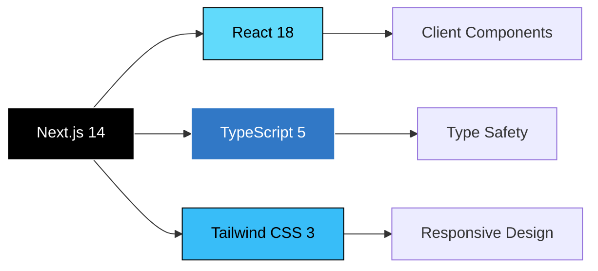
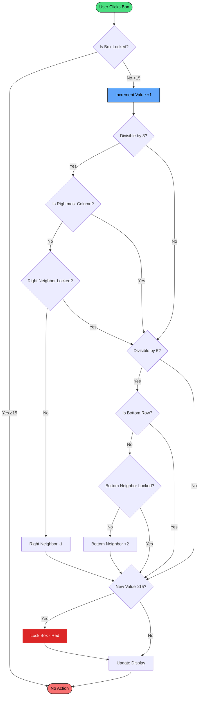
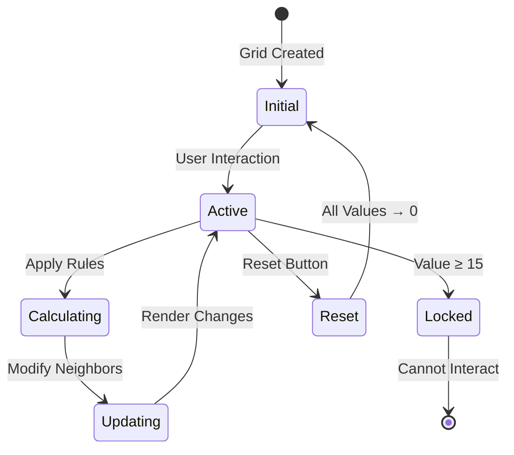
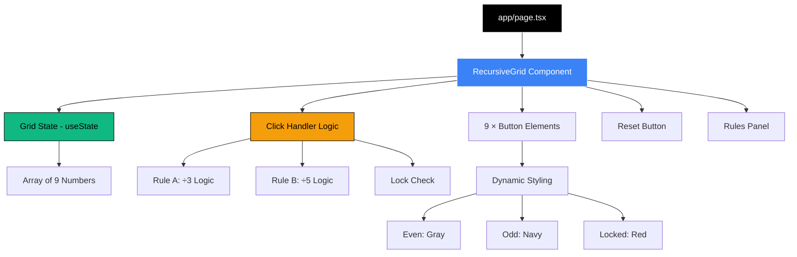
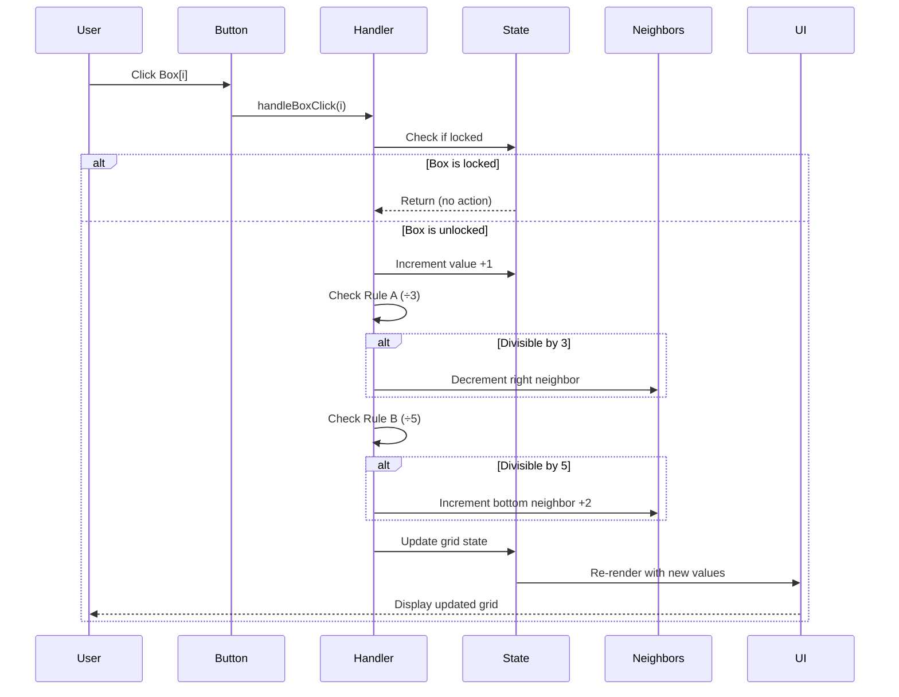

# 🎮 Recursive Grid

<div align="center">


**An interactive 3×3 grid game with cascading ripple effects and dynamic locking mechanics**

[Live Demo](#) • [Features](#-features) • [Installation](#-installation) • [Documentation](#-how-it-works)

</div>

---

## 📋 Table of Contents

- [Overview](#-overview)
- [Features](#-features)
- [Tech Stack](#-tech-stack)
- [Installation](#-installation)
- [How It Works](#-how-it-works)
- [Game Rules](#-game-rules)
- [Architecture](#-architecture)
- [Project Structure](#-project-structure)
- [Deployment](#-deployment)
- [License](#-license)

---

## 🎯 Overview

**Recursive Grid** is an interactive web application that demonstrates complex state management and cascading effects through a simple 3×3 grid interface. Each box interaction triggers a series of ripple effects based on mathematical rules, creating an engaging puzzle-like experience.

### Key Highlights

- ✨ **Smooth Animations**: 200ms transitions with spring-like feedback
- 🎨 **Dynamic Styling**: Color-coded boxes based on even/odd values
- 🔒 **Locking Mechanism**: Boxes lock at value ≥15 with visual feedback
- 🌊 **Ripple Effects**: Neighbor interactions based on divisibility rules
- 📱 **Responsive Design**: Works seamlessly across all devices
- ♿ **Accessible**: Keyboard navigation and screen reader support

---

## ✨ Features

### Core Functionality

| Feature | Description |
|---------|-------------|
| **Click Interaction** | Increment box value by 1 on each click |
| **Rule A (÷3)** | When divisible by 3 → right neighbor -1 |
| **Rule B (÷5)** | When divisible by 5 → bottom neighbor +2 |
| **Locking System** | Boxes lock when value ≥15 (red, unclickable) |
| **Edge Protection** | No crashes at grid boundaries |
| **Negative Values** | Full support for negative numbers |

### UI/UX Enhancements

- 🎭 **Hover Effects**: Lift animation with scale to 105%
- 👆 **Click Feedback**: Scale-down animation on interaction
- 🌈 **Gradient Background**: Subtle slate-to-indigo gradient
- 🔄 **Reset Button**: One-click grid reset with gradient styling
- 📊 **Rules Panel**: Interactive guide with emoji indicators

---

## 🛠️ Tech Stack



### Dependencies

- **Framework**: Next.js 14+ (App Router)
- **Language**: TypeScript 5.0+
- **Styling**: Tailwind CSS 3.0+
- **Runtime**: Node.js 18+

---

## 🚀 Installation

### Prerequisites

- Node.js 18.0 or higher
- npm, yarn, or pnpm

### Quick Start

```bash
# Clone the repository
git clone https://github.com/yourusername/recursive-grid.git
cd recursive-grid

# Install dependencies
npm install

# Run development server
npm run dev

# Open browser
# Navigate to http://localhost:3000
```

### Build for Production

```bash
# Create optimized production build
npm run build

# Start production server
npm start
```

---

## 🎮 How It Works

### Game Flow Diagram



### State Management



---

## 📖 Game Rules

### Rule A: Divisibility by 3

When a box reaches a value divisible by 3:

```
┌───┬───┬───┐
│ 3 │ 0 │   │  →  Click Box[0] to 3
└───┴───┴───┘
│   │   │   │
└───┴───┴───┘
│   │   │   │
└───┴───┴───┘

┌───┬───┬───┐
│ 3 │-1 │   │  →  Box[1] decrements by 1
└───┴───┴───┘
│   │   │   │
└───┴───┴───┘
│   │   │   │
└───┴───┴───┘
```

### Rule B: Divisibility by 5

When a box reaches a value divisible by 5:

```
┌───┬───┬───┐
│ 5 │   │   │  →  Click Box[0] to 5
└───┴───┴───┘
│ 0 │   │   │
└───┴───┴───┘
│   │   │   │
└───┴───┴───┘

┌───┬───┬───┐
│ 5 │   │   │  →  Box[3] increments by 2
└───┴───┴───┘
│ 2 │   │   │
└───┴───┴───┘
│   │   │   │
└───┴───┴───┘
```

### Locking Mechanism

```
Value < 15  →  Clickable (Gray/Navy)
Value ≥ 15  →  Locked (Red, cursor-not-allowed)
```

---

## 🏗️ Architecture

### Component Hierarchy



### Data Flow



---

## 📁 Project Structure

```
recursive-grid/
├── app/
│   ├── page.tsx              # Main page component
│   ├── layout.tsx            # Root layout
│   ├── globals.css           # Global styles + Tailwind
│   └── favicon.ico           # App icon
├── components/
│   └── RecursiveGrid.tsx     # Core grid logic & UI
├── public/                   # Static assets
├── .gitignore
├── package.json
├── tsconfig.json             # TypeScript config
├── tailwind.config.ts        # Tailwind config
├── next.config.ts            # Next.js config
└── README.md                 # This file
```

---

## 🌐 Deployment

### Deploy to Vercel (Recommended)

[](https://vercel.com/new/clone?repository-url=https://github.com/yourusername/recursive-grid)

```bash
# Install Vercel CLI
npm i -g vercel

# Deploy
vercel
```

### Environment Variables

No environment variables required for this project.

---

## 🎨 Customization

### Modify Grid Size

Edit `components/RecursiveGrid.tsx`:

```typescript
// Change from 3x3 to 4x4
const [grid, setGrid] = useState<number[]>(Array(16).fill(0));

// Update grid layout
<div className="grid grid-cols-4 gap-4 ...">
```

### Adjust Rules

Modify the ripple logic in `handleBoxClick`:

```typescript
// Change Rule A: divisible by 4 instead of 3
if (newValue % 4 === 0) {
  // Custom logic
}
```

---

## 📄 License

This project is licensed under the **MIT License** - see the [LICENSE](LICENSE) file for details.

---

## 🤝 Contributing

Contributions are welcome! Please feel free to submit a Pull Request.

1. Fork the repository
2. Create your feature branch (`git checkout -b feature/AmazingFeature`)
3. Commit your changes (`git commit -m 'Add some AmazingFeature'`)
4. Push to the branch (`git push origin feature/AmazingFeature`)
5. Open a Pull Request

---

## 🙏 Acknowledgments

- Built with [Next.js](https://nextjs.org/)
- Styled with [Tailwind CSS](https://tailwindcss.com/)
- Deployed on [Vercel](https://vercel.com/)

---

<div align="center">

**Made with ❤️ by [Your Name]**

⭐ Star this repo if you find it helpful!

</div>
